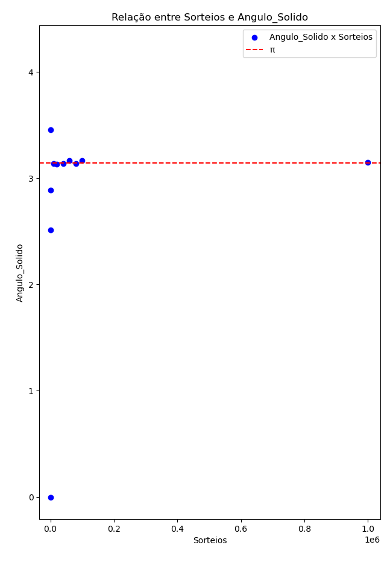
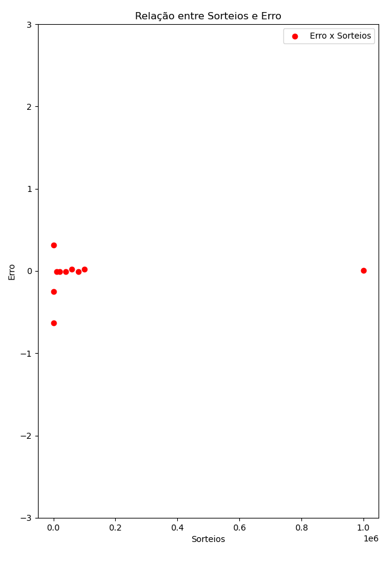
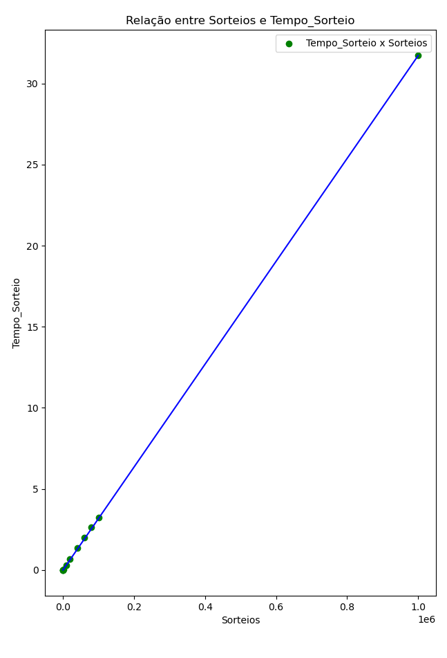

## Sobre o projeto
Este projeto visa simular um contexto geométrico envolvendo uma esfera com uma abertura. Dentro dessa esfera, uma fonte isotrópica emite partículas aleatórias uniformemente em todas as direções.

### Objetivos do projeto
- O principal objetivo deste projeto é estimar o valor do ângulo sólido correspondente à abertura da esfera.
Utilizamos a seguinte fórmula para cálculo:

    $\Omega$ = $\\frac{(4 * \pi) * \text{Pontos no angulo sólido}}{\text{Total de pontos sorteados}} \$

- Gerar gráficos que facilitam a análise dos resultados. Os gráficos gerados incluem:
    - Gráfico de tendência (Ângulo Sólido x \pi)
 
      
    
    - Gráfico de relação Erro x Sorteios

       
       
    - Gráfico de relação Sorteios x Tempo
 
       

     

<!--
## Simulação com montecarlo
-->
